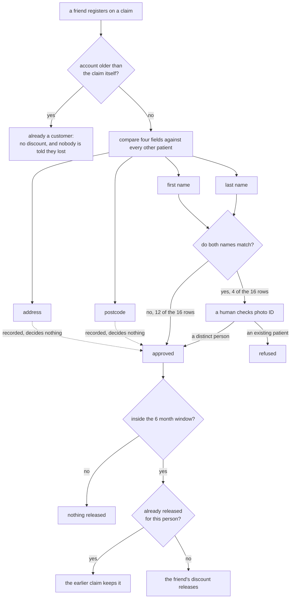
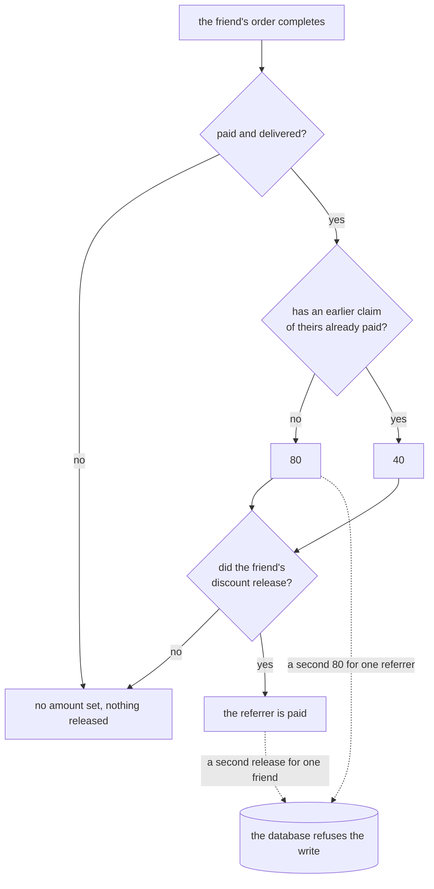
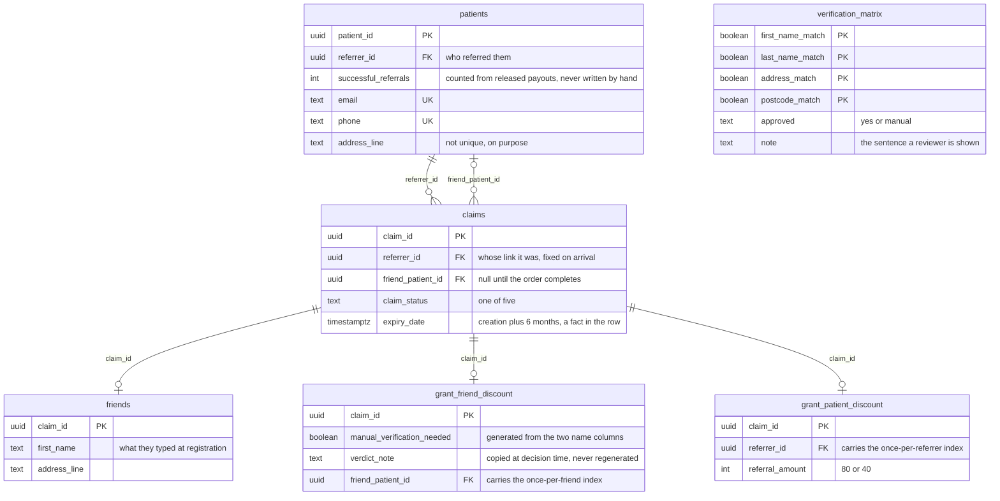
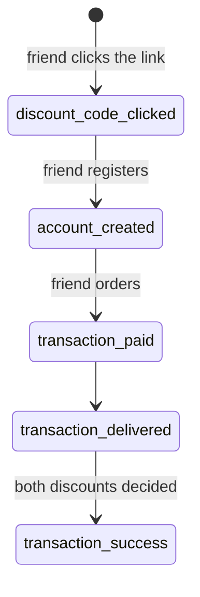

# The duplicate check, rebuilt

Bolt Pharmacy's referral programme refuses referrals between people who share an address. Two
customers wrote it down publicly. One was told his housemate was already a customer, which was
untrue, and the housemate bought from a competitor instead. The other switched to Bolt because
her husband referred her. She then watched her own referral credit disappear, from what she
described as their two accounts merging over a shared home address.

A pharmacy already knows who its patients are. So this asks a better question, and it runs.

## What those refusals cost

Advocate Share at end of 26Q1 was 10.22%, so 9 in 10 customers have never referred once. Every
refused referral is a customer who did the work and never became an advocate. The friend they
brought is a net new customer who was turned away at the door.

I cannot size that from outside. Nobody publishes how often the check fires, and no review tells
you the denominator. **That is the one number I would want in week 1.** Query the refusal reasons
in your own data, then count what share of blocks are households rather than duplicates. Until
that query runs the rate is unknown, and I will not guess at it.

## A pharmacy can ask a better question than a shop can

A shop has to ask "same address?", because an address is all it holds. A pharmacy holds patient
records, so it can ask whether this is the same person. Those are different questions, and they
disagree exactly where it hurts. A couple. A houseshare. A parent and an adult child.

The rule here is one line. **A human looks only when a first name and a last name both match an
existing patient.** A shared address changes nothing. A shared postcode changes nothing. A shared
bank card changes nothing. All three are recorded, shown, and ignored by the verdict.

## Six tables, one rule, nineteen cases, two guarantees

It runs on Postgres. Every verdict below was computed inside the database by the code in this
repository, not written by hand.

## Look at what it decided

**[The nineteen cases on one page](https://joleneann.github.io/bolt-referral-tables/cases.html)**,
each one a situation and what the system did about it.

**[`results.md`](results.md) is the same nineteen in full.** Every comparison made, every verdict,
and the reason stored at the time. Both pages are written by a script that reads the live tables,
so neither can drift away from what the system does.

Six of the nineteen went to a human, and every one of them turned on a full name. Three matched
an address or a postcode without matching both names. None of those three was refused.

## A human looks only when both names match



The rule is stored as data, not buried in code, so you can read it without reading SQL:
**[all 16 combinations with their reasons](https://doiyvwwvddgokurwyvvb.supabase.co/rest/v1/verification_matrix?select=first_name_match,last_name_match,address_match,postcode_match,approved,note&order=first_name_match.desc,last_name_match.desc,address_match.desc,postcode_match.desc&apikey=sb_publishable__nHann-Y9PXbsuaJVmcAxg__f8Y0Rvy)**,
straight out of Postgres in a browser. Change the rule and you edit a row, not a deploy.

Manual review is 4 of 16 combinations, and it exists because UK photo ID carries no number to
match on. It is a routed exception, not a queue somebody staffs.

## What it refuses to pay



Two rules are held by the database itself rather than by code that could race or be rewritten:

```sql
create unique index one_first_claim_per_referrer
  on grant_patient_discount (referrer_id) where referral_amount = 80;

create unique index one_release_per_friend
  on grant_friend_discount (friend_patient_id) where release_friend_discount;
```

A referrer is paid 80 once, ever. A friend is released once, ever, no matter how many people
claimed them. [`seed-cases.sql`](seed-cases.sql) attempts a second 80 on purpose and fails loudly if the
database ever accepts it.

Three cases show the refusals working. Someone claims a contact that already belongs to a patient,
and no reward is owed because nobody new arrived. Someone claims under a fresh email as an
existing patient, and the photo ID check catches it. Two customers claim the same friend, and the
earlier claim keeps it while the later one is told nothing rather than told they lost.

## What this does not do

It does not decide who gets asked to refer, or when, and that is where the 26.8 day average to
first referral gets attacked. It does not choose an analytics stack. It does not touch the share
moment or the 1000 second window after purchase. It does not model K. The published figures cover
different populations over different windows, and I will not publish arithmetic I cannot defend
line by line.

It also does not put anything in public. Sharing stays inside private 1 to 1 channels. Public
posts naming prescription medicines are advertising, and the regulator ruled against four UK
brands for exactly that in February 2026.

## Verify it live

Read-only, no account, no terminal. The key below is the publishable one, which is meant to be
public.

- [The 20 claims, with both verdicts and the stored reason](https://doiyvwwvddgokurwyvvb.supabase.co/rest/v1/claims?select=friend_email,friend_phone,claim_channel,claim_status,grant_friend_discount(manual_verification_needed,approved,verdict_note,release_friend_discount),grant_patient_discount(first_claim,referral_amount,release_patient_discount)&order=creation_date&apikey=sb_publishable__nHann-Y9PXbsuaJVmcAxg__f8Y0Rvy)
- [The patients, with successful_referrals counted from released payouts](https://doiyvwwvddgokurwyvvb.supabase.co/rest/v1/patients?select=first_name,last_name,address_line,postcode,successful_referrals,customer_since&order=customer_since&apikey=sb_publishable__nHann-Y9PXbsuaJVmcAxg__f8Y0Rvy)
- [Every verification, with the four comparisons](https://doiyvwwvddgokurwyvvb.supabase.co/rest/v1/grant_friend_discount?select=first_name_match,last_name_match,address_match,postcode_match,manual_verification_needed,manual_approved,approved,verdict_note,release_friend_discount&apikey=sb_publishable__nHann-Y9PXbsuaJVmcAxg__f8Y0Rvy)
- [Every payout decision](https://doiyvwwvddgokurwyvvb.supabase.co/rest/v1/grant_patient_discount?select=transaction_success,first_claim,referral_amount,release_patient_discount&apikey=sb_publishable__nHann-Y9PXbsuaJVmcAxg__f8Y0Rvy)

Filtering works: add `&approved=eq.false` to the verifications, or `&referral_amount=eq.80` to the
payouts. Writing does not. Select is the only privilege granted to anonymous readers, so an insert
returns 42501.

## What is real and what is not

The tables, the rule, the two indexes and both decision functions are real. Running a case queries
Postgres and writes rows.

The people are invented and the phone numbers come from Ofcom's test range.

The 80 and 40 are Bolt's own published amounts, captured from their live referral page on
2026-07-23. A first referral pays 80, every referral after pays 40, and the friend gets 40.

The old rule is inferred and labelled as inference everywhere it appears. Bolt has never published
how their duplicate check works. What is documented is what customers experienced, in their own
words, on Trustpilot.

## How it is put together

Five tables from the design sheet, plus the rule stored as a sixth.



`verification_matrix` has no foreign key to anything. The four booleans look it up at decision
time, and the answer is copied onto the decision. Editing the rule later cannot rewrite what a
past reviewer was shown.

A claim exists from the moment someone clicks, before any account does. That is the repair: today
a referral is a browsing session, and a closed tab ends it.



The window is a date on the row rather than a state, so a claim that runs out of time needs
nobody to notice.

**Files.** [`tables.md`](tables.md) is the design, written before the SQL.
[`schema.sql`](schema.sql) builds it. [`seed-matrix.sql`](seed-matrix.sql) loads the 16 rows of
the rule. [`seed-cases.sql`](seed-cases.sql) adds the nineteen cases as rows and nothing else:
delete it and the system still stands. Run them in that order, all three safe to re-run.
`render-tables.mjs` reads the live tables and writes [`results.md`](results.md) and
[`data/*.csv`](data/), which GitHub renders as sortable grids.

Concept work by Jolene Fernandes. Not affiliated with Bolt Pharmacy.
