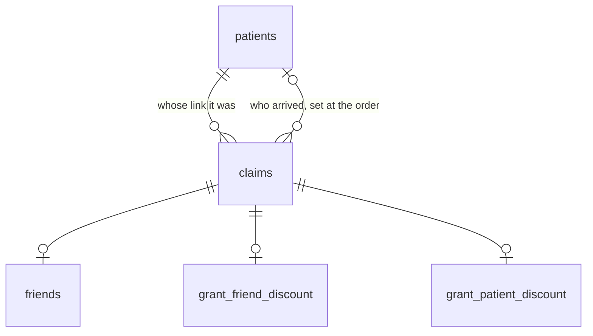

# The duplicate check, rebuilt

Bolt Pharmacy's referral programme refuses referrals between people who share an address. Two
customers wrote it down in public. One was told his housemate was already a customer. That was
untrue, and the housemate bought from a competitor instead. The other joined because her husband
referred her, then watched her own credit vanish when their accounts merged over a shared home
address.

Both of those referrals happened. Neither was paid. An address is not an identity, and matching on
one turns every household into a duplicate.

This is that check rebuilt: six Postgres tables, one rule, nineteen worked cases, every verdict
decided inside the database and readable without an account.

## The one number I do not have

I cannot size how often this happens. Nobody publishes how many referrals the check refuses, and
no review tells you the denominator. That is the first query I would run: pull the refusal reasons
and count what share of blocks are households rather than genuine duplicates. Until it runs the
rate is unknown, and I will not guess at it.

## A pharmacy can ask a better question than a shop can

A shop has to match on an address, because an address is all it holds. A pharmacy holds patient
records, so it can ask whether this is the same person. Those two tests disagree exactly where it
hurts. A couple. A houseshare. A parent and an adult child.

**So the rule is one line: a human looks only when a first name and a last name both match an
existing patient.** A shared address changes nothing. A shared postcode changes nothing. A shared
bank card changes nothing. All three are recorded, shown, and ignored by the verdict.

The whole rule is 16 rows in a table, not logic buried in code:

| first name | last name | address | postcode | verdict | why |
|---|---|---|---|---|---|
| yes | yes | yes | yes | **a human looks** | could be father and son, same name, same address |
| yes | yes | yes | no | **a human looks** | could be the same person, different postcode |
| yes | yes | no | yes | **a human looks** | neighbours with same names |
| yes | yes | no | no | **a human looks** | could be the same person at a different address |
| yes | no | yes | yes | approved | |
| yes | no | yes | no | approved | |
| yes | no | no | yes | approved | neighbours with the same first name |
| yes | no | no | no | approved | |
| no | yes | yes | yes | approved | family members |
| no | yes | yes | no | approved | |
| no | yes | no | yes | approved | |
| no | yes | no | no | approved | |
| no | no | yes | yes | approved | unrelated housemates |
| no | no | yes | no | approved | |
| no | no | no | yes | approved | |
| no | no | no | no | approved | |

[Read those 16 rows straight out of the live database.](https://doiyvwwvddgokurwyvvb.supabase.co/rest/v1/verification_matrix?select=first_name_match,last_name_match,address_match,postcode_match,approved,note&order=first_name_match.desc,last_name_match.desc,address_match.desc,postcode_match.desc&apikey=sb_publishable__nHann-Y9PXbsuaJVmcAxg__f8Y0Rvy)
Change the rule and you edit a row, not a deploy. Manual review exists because UK photo ID carries
no number to match on, and it is 4 of 16 combinations, not a queue somebody staffs.

## The refusal they documented, running

Case 6 of the nineteen is the housemate case: same address, same postcode, two different people.
Here is what the database recorded.

| first name | last name | address | postcode | goes to a human | verdict |
|---|---|---|---|---|---|
| no | no | yes | yes | no | **approved** |

Reason stored at the time: **unrelated housemates**. The address and the postcode both matched,
both were recorded, and neither one decided anything.

## Nineteen cases, decided inside the database

Six of the nineteen went to a human, and every one of them turned on a full name. Three matched an
address or a postcode without matching both names. None of those three was refused.

**[`results.md`](results.md) is all nineteen in full**: every comparison made, every verdict, and
the reason stored at the time. It is written by a script that reads the live tables, so it cannot
drift away from what the system does.

## What it refuses to pay

Four cases end with nobody paid, and each one is a different reason. Someone claims a contact that
already belongs to a patient, so nobody new arrived. Someone claims under a fresh email as an
existing patient, and the photo ID check catches it. Two customers claim the same friend, and the
earlier claim keeps it while the later one is told nothing rather than told they lost. And a
referrer who already has an 80 is refused a second one by the database itself.

Two promises are held by partial unique indexes rather than by code that could race:

```sql
create unique index one_first_claim_per_referrer
  on grant_patient_discount (referrer_id) where referral_amount = 80;

create unique index one_release_per_friend
  on grant_friend_discount (friend_patient_id) where release_friend_discount;
```

A referrer is paid 80 once, ever. A friend is released once, ever, no matter how many people
claimed them. [`seed-cases.sql`](seed-cases.sql) attempts a second 80 on purpose and fails loudly
if the database ever accepts it.

## What this does not do

It does not decide who gets asked to refer, or when. It does not touch the share moment, the
message, or anything before the click. It starts at the claim and stops at the payout. Getting
more people to refer is a different job from paying correctly the ones who already did.

It also puts nothing in public. Sharing stays inside private 1 to 1 channels. Public posts naming
prescription medicines are advertising, and the regulator ruled against four UK brands for exactly
that in February 2026.

## The six tables



- `patients`, the account list. `successful_referrals` is counted from released payouts by a
  trigger, never written by hand. `address_line` is not unique, on purpose.
- `claims`, one row per link click, written before any account exists. `expiry_date` is creation
  plus 6 months, a fact in the row rather than a job somebody runs.
- `friends`, what the friend typed at registration.
- `grant_friend_discount`, one verification per claim. `manual_verification_needed` is generated
  by the database from the two name columns, and `verdict_note` is copied in at decision time.
- `grant_patient_discount`, one payout decision per claim, carrying `referrer_id` so the index can
  refuse a second 80.
- `verification_matrix`, the 16 rows above. It has no foreign key to anything. The four booleans
  look it up at decision time, and the answer is copied onto the decision. A later edit to the rule
  cannot rewrite what a past reviewer was shown.

A claim exists from the moment someone clicks, before any account does. That is the repair: today
a referral is a browsing session, and a closed tab ends it.

## Files, and the order they run

The schema lives in [`supabase/migrations/`](supabase/migrations/) and is applied by Supabase's
GitHub integration: a push to `main` runs any migration this project has not run yet. The three
there are the six tables and both decision functions, then `successful_referrals` becoming a real
column maintained by trigger, then closing the write functions to signed-in users.

The data is seeded by hand, in this order, and both files are safe to re-run:

1. [`seed-matrix.sql`](seed-matrix.sql), the 16 rows of the rule.
2. [`seed-cases.sql`](seed-cases.sql), the nineteen cases as data. Delete it and the system still
   stands.

Then `node render-tables.mjs` reads the live tables and writes [`results.md`](results.md) and
[`data/*.csv`](data/), which GitHub renders as sortable grids.

[`tables.md`](tables.md) is the design, written before the SQL.

## Read it live

No account, no terminal. The key in these links is the publishable one, which is meant to be
public.

- [The 20 claims, with both verdicts and the stored reason](https://doiyvwwvddgokurwyvvb.supabase.co/rest/v1/claims?select=friend_email,friend_phone,claim_status,grant_friend_discount(manual_verification_needed,approved,verdict_note,release_friend_discount),grant_patient_discount(first_claim,referral_amount,release_patient_discount)&order=creation_date&apikey=sb_publishable__nHann-Y9PXbsuaJVmcAxg__f8Y0Rvy)
- [The patients, with successful_referrals counted from released payouts](https://doiyvwwvddgokurwyvvb.supabase.co/rest/v1/patients?select=first_name,last_name,address_line,postcode,successful_referrals,customer_since&order=customer_since&apikey=sb_publishable__nHann-Y9PXbsuaJVmcAxg__f8Y0Rvy)
- [Every verification, with the four comparisons](https://doiyvwwvddgokurwyvvb.supabase.co/rest/v1/grant_friend_discount?select=first_name_match,last_name_match,address_match,postcode_match,manual_verification_needed,manual_approved,approved,verdict_note,release_friend_discount&apikey=sb_publishable__nHann-Y9PXbsuaJVmcAxg__f8Y0Rvy)
- [Every payout decision](https://doiyvwwvddgokurwyvvb.supabase.co/rest/v1/grant_patient_discount?select=transaction_success,first_claim,referral_amount,release_patient_discount&apikey=sb_publishable__nHann-Y9PXbsuaJVmcAxg__f8Y0Rvy)

Filtering works: add `&approved=eq.false` to the verifications, or `&referral_amount=eq.80` to the
payouts. Writing does not. Select is the only privilege granted to anonymous readers, so an insert
returns 42501.

## What is real and what is not

The tables, the rule, both indexes and both decision functions are real. Every verdict was computed
in Postgres, not typed.

The people are invented and the phone numbers come from Ofcom's test range.

The 80 and 40 are Bolt's own published amounts, captured from their live referral page on
2026-07-23.

The old rule is inferred from what customers described in public, and labelled as inference
wherever it appears. Bolt has never published how their check works.

Concept work by Jolene Fernandes. Not affiliated with Bolt Pharmacy.
